# London Metering Data
  * The data was composed of two(2) sets of CSV's.  One containing energy values on every half hour and one containing weather values on every hour.  

## Cleaning and joining the data
  *  The two set of data were joined on the time stamp associated with them.  Half hour data was dropped due to convenience.  
  * The metering data came in a strings where there were there should have been floats.  This data needed to be converted to numeric values.
  * Data had to be one hot encoded for some of the weather features.

  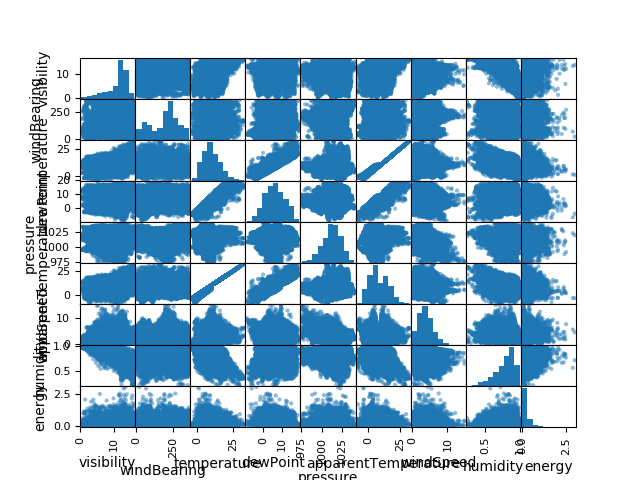

  ## Initial Data analysis
    * Energy values vary widely between meters and time.
     * the variation in meter energy could depend on house or business that is using the meter.  In the future I would break add in a parameter for meter application to verify what the meters purpose is.

  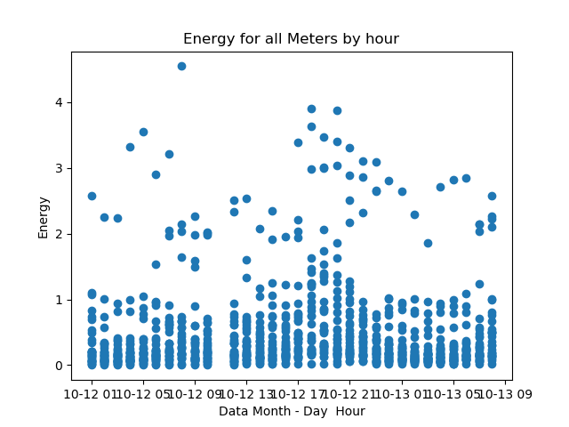
  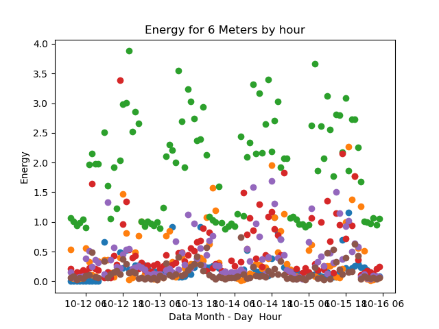
  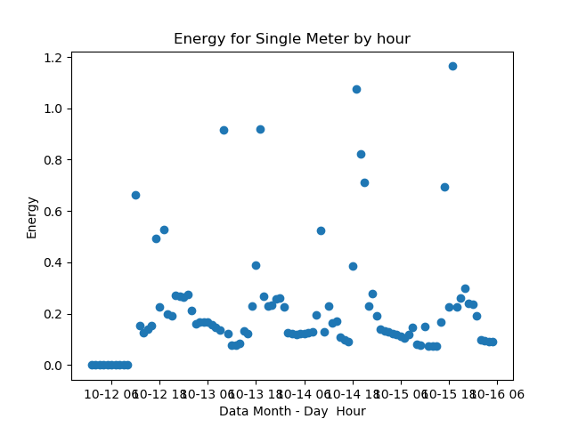
  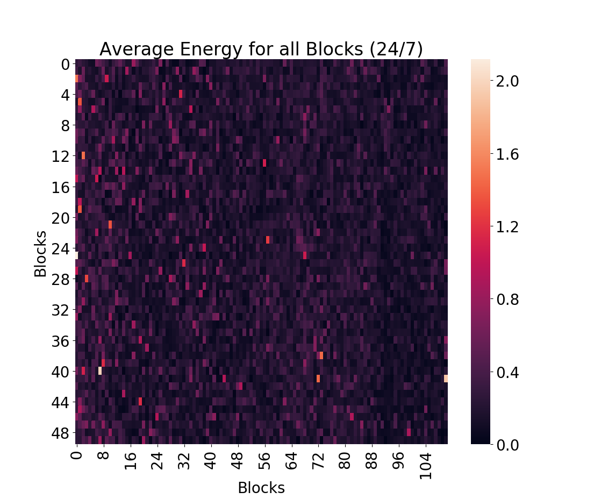

## Initial Model Time not used
  * I did not use time because I knew that energy peaks in the morning and evening for most residential homes.  I wanted to see if we could do a prediction without time.
  * Initially I used a LinearRegression, RidgeCV, and LassoCV on one blocks data.  This included the one hot encoded values of the meters. The scores where not great.

##### Block Scores (R^2) for all meters
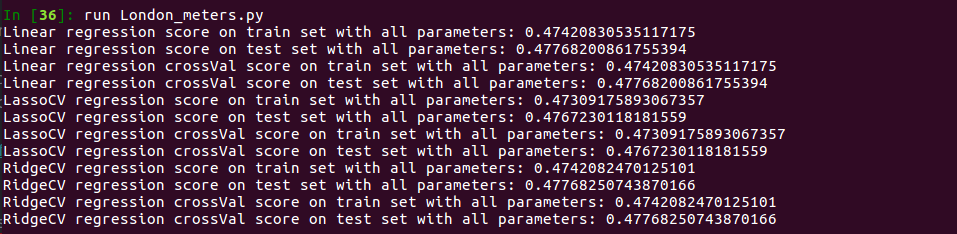

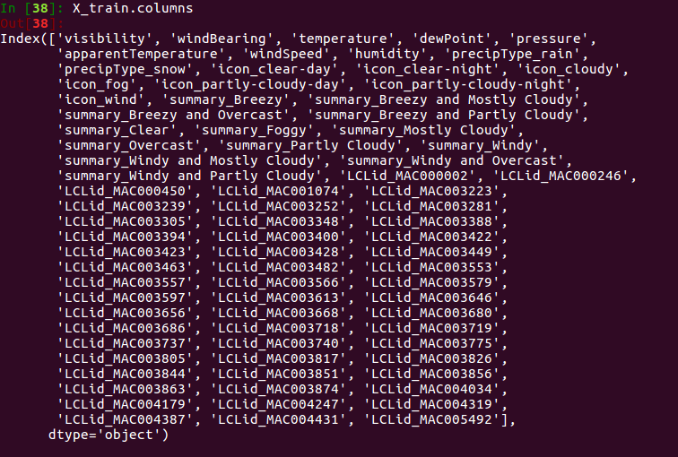

##### Meter Scores for single meter

  * With this model I began removing features that had a zero (0) in the lasso coefficients.  This made the models only slightly better

##### Single Meter with LassoCV Reduction
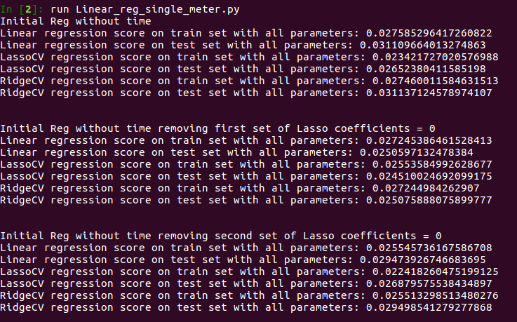

# Making a Better Model With time

  * I added in hour of day and day of week into model.  I though this would make a significant impact.  It surprisingly did not. It thought that the time of day and day of week would play a larger role in the energy consumption prediction.    

  *  With this I again began to remove features that had a zero (0) in the lasso coefficients.  This improved the model only slightly again.

##### Single Meter with LassoCV Reduction with time

  * I added in one hot encoded time values into the prediction. We can see it improved by about 0.2 on the R^2 score.  This is fairly large considering where the model started from.

  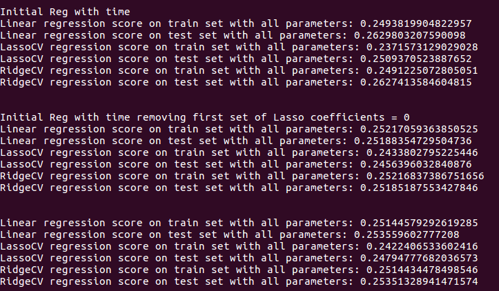

  *  Could it be that I picked a meter that was more random?
    * I ran the the model over 40 of the 50 meters in the block and found that my scores were all similar.
    * Nope the average and median where:  0.24

##### Block with LassoCV Reduction with time
  * Did the Block fair any better with the added time parameter?
    * Yes it did

    * I then removed columns with high collinearity thinking this could be the issue with my model.  
      * Once again this was not.

  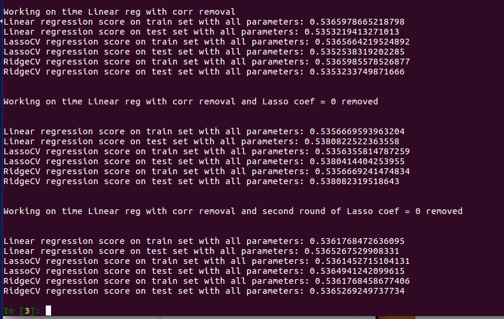

# Results
  * Blocks
  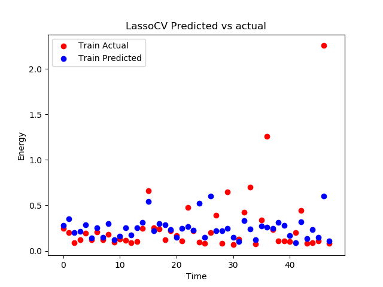

  * Meters
  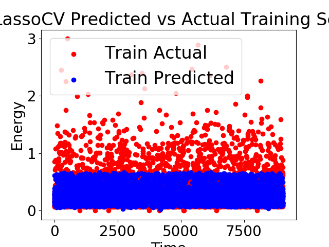
  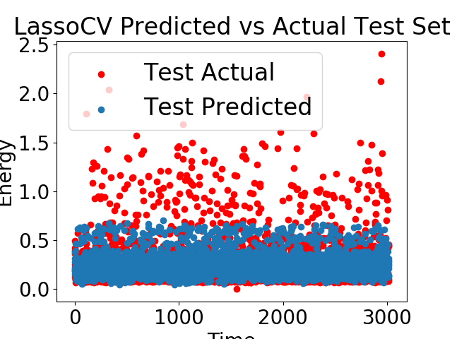
  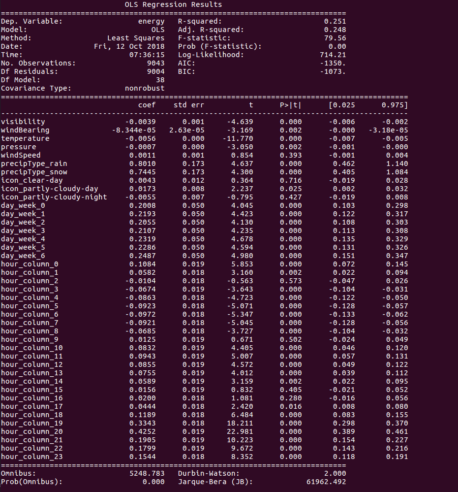
  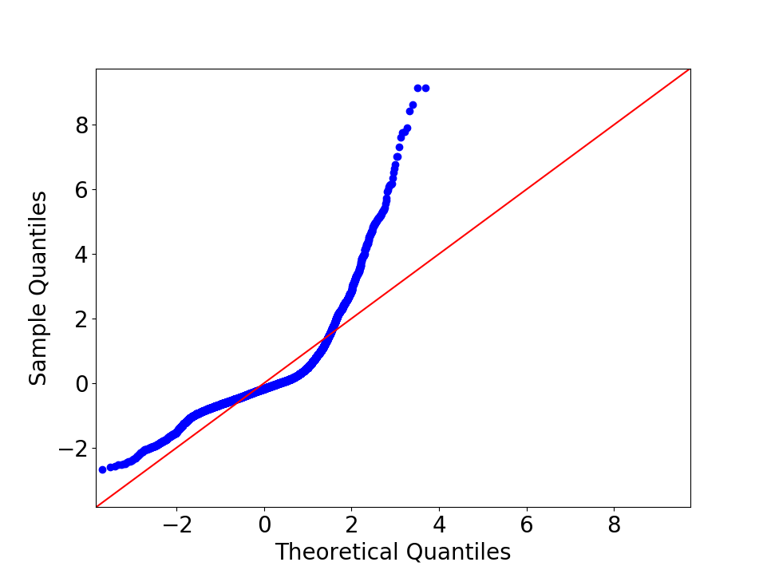

# Future improvements
  * Reduce features and look more into what is collinear.  

  * Add in meter purpose parameter. I believe associating the meter with the business or type of home would increase the models accuracy.

  * Create a block and meter class that stores the values needed to be calculated.  Currently each model is in its own script.

  * Re-factor and optimize code to run faster.  One of my function took 11 min to run.
