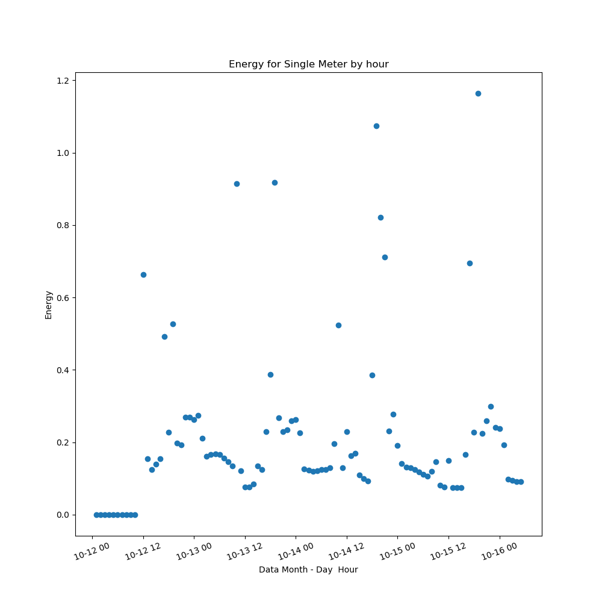

# London Energy Metering
  * The goal of this project was to look into the energy data provided to see if linear regression could provide a good model to predict the future energy usage.  

## Data  
  * The data was composed of sets of CSV's.  There was daily and hourly data for the energy and weather data. I chose to pick the hourly data sets.  
  *  The data was taken from Kraggle and is located here: https://www.kaggle.com/jeanmidev/smart-meters-in-london .
  * The data consisted of Acorns which are regions.  Each Acorn is made up of multiple blocks.  Each block has multiple smrt meters.

## Cleaning and joining the data
  *  The two set of data were joined on the time stamp associated with them.  Half hour data was dropped due to convenience.  
  * The metering data came in a strings where there were there should have been floats.  This data needed to be converted to numeric values.
  * Data had to be one hot encoded for some of the weather features.

  

  * Weather Metrics:  'visibility', 'windBearing', 'temperature', 'pressure', 'windSpeed', 'humidity', 'precipType_rain', 'precipType_snow', 'icon_clear-day',
       'icon_clear-night', 'icon_cloudy', 'icon_fog', 'icon_partly-cloudy-day', 'icon_partly-cloudy-night', 'icon_wind', 'summary_Breezy', 'summary_Breezy and Mostly Cloudy', 'summary_Breezy and Overcast', 'summary_Breezy and Partly Cloudy', 'summary_Clear', 'summary_Foggy', 'summary_Mostly Cloudy', 'summary_Overcast', 'summary_Partly Cloudy', 'summary_Windy', 'summary_Windy and Mostly Cloudy', 'summary_Windy and Overcast'

  ## Initial Data analysis
    * Energy values vary widely between meters and time.
      * the variation in meter energy could depend on house or business that is using the meter.  In the future I would break add in a parameter for meter application to verify what the meters purpose is.

  
  
  
  

## Initial Model Time not used
  * The first liner regression model I built used only weather data as the features.   This kept the energy as the y value we where hoping to predict.
  * I did not use time because I knew that energy peaks in the morning and evening for most residential homes.  I wanted to see if we could do a prediction without time.
  * Initially I used a LinearRegression, RidgeCV, and LassoCV on one block of data.  This included the one hot encoded values of the meters, weather summaries, and Icon values. The scores where not great for the train or the test set.

##### Block Scores (R^2) for all meters

##### Meter Scores for single meter

  * With this model I began removing features that had a zero (0) in the lasso coefficients.  This made the models only slightly better

##### Single Meter with LassoCV Reduction

# Making a Better Model With time

  * I added in hour of day and day of week into model.  I though this would make a significant impact.  It surprisingly did not. It thought that the time of day and day of week would play a larger role in the energy consumption prediction.    

  *  With this I again began to remove features that had a zero (0) in the lasso coefficients.  This improved the model only slightly again.

##### Single Meter with LassoCV Reduction with time

  * I added in one hot encoded time values into the prediction. We can see it improved by about 0.2 on the R^2 score.  This is fairly large considering where the model started from.

  

  *  Could it be that I picked a meter that was more random?
    * I ran the the model over 40 of the 50 meters in the block and found that my scores were all similar.
    * Nope the average and median where:  0.24

##### Single Block with LassoCV Reduction with time
  * Did the Block fair any better with the added time parameter?
    * Yes it did.  By about 0.1 in the R^2 score.

    * I then removed columns with high collinearity thinking this could be the issue with my model.  
      * Once again this was not and the R^2 scores remained close to the same.

  

# Results
  * Blocks:
    * Looking at the graph below we can see that we are close to predicting the normal non peak energy consumption.  We fail at modeling the peak values.

  

  * Meters
   * The meters have the same issue as the blocks.  Predicting peak hours is not being done.  

  
  
  

# Future improvements
  * Look into squaring or taking the log of certain features to see if this could be the issue for under fitting the data.
  * Reduce features and look more into what is collinear.  

  * Add in meter purpose parameter. I believe associating the meter with the business or type of home would increase the models accuracy.

  * Focus on certain points in the day instead of all hours.  The middle of the night has lower energy use in general.

  * Create a block and meter class that stores the values needed to be calculated.  Currently each model is in its own script.

  * Re-factor and optimize code to run faster.  One of my function took 11 min to run.
